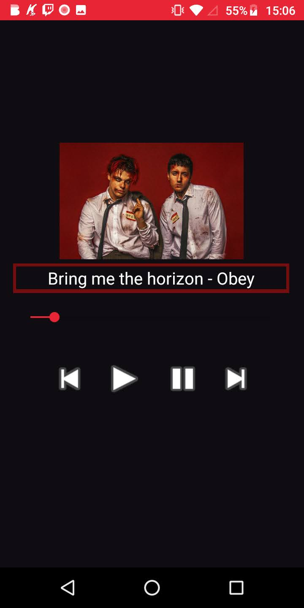
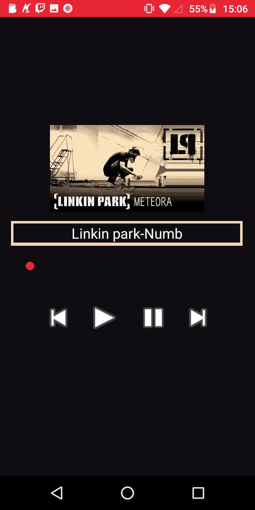
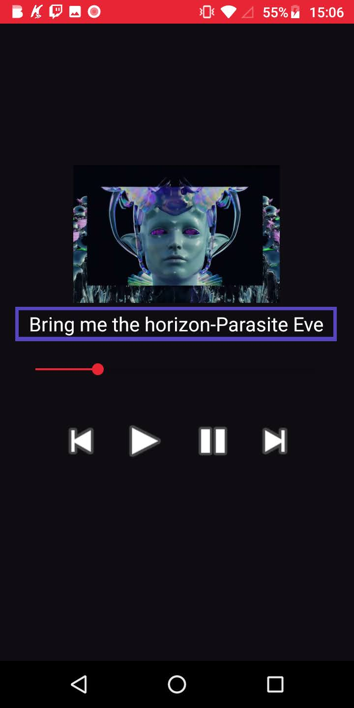

<h1>Sobre :</h1>

<ul>
  <li>Aplicativo básico de reprodução de musicas que ja vem no aplicativo</li>
  <li>Possui 3 musicas para reprodução</li>
</ul>

 
<h1>Capturas de tela:<h1>
  
  
  
 

<h1>Como funciona :</h1>

<ul>
  <li> O aplicativo foi feito para reproduzir somente as 3 músicas que podem ser encontradas no diretório MusicPlayer\app\src\main\res\raw</li>
  <li> O aplicativo possui 3 botões sendo eles : botão de voltar, iniciar, parar e proximo </li>
  <li> A seekbar se move de acordo com o tempo de reprodução da música<l1>
  <li> A imagem, nome e cor envolta do nome da música são alterados de acordo com a música que estiver sendo reproduzida<l1>
</ul>
