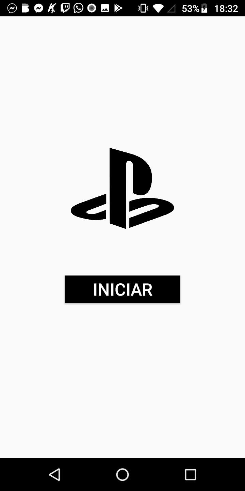
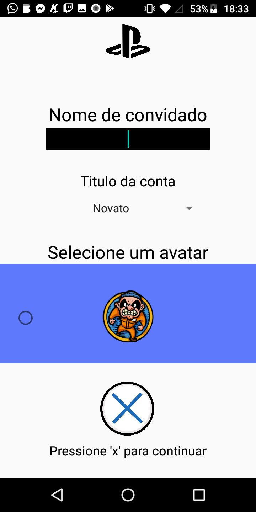
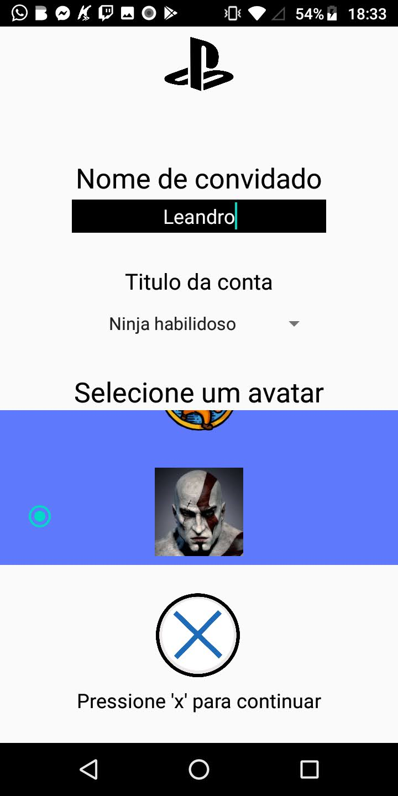

<h1>Sobre :</h1>
  <h3>Aplicativo simples com algumas funções aprendidas durante as aulas, o aplicativo é sobre a marca playstation com algumas informações sobre o playstatition 5 (desenvolvido com o intuito de praticar os conteúdos das aulas)</h3>
 
<h1>Capturas de tela:<h1>
  
  
  
  
  
  
  
  
  
  
  
 

<h1>Como funciona :</h1>

<ul>
  <li> O aplicativo salva o nome que o usuário inserir e apresenta logo em seguida em uma activity com as informações que o usuário escolher, entre elas estão</li>
  <ul>
    <li>Nome do usuário</li>
    <li>Titulo do usuário </li>
    <li>Avatar do usuário</li>
  </ul>
  <li> O aplicativo também envia notificação após o usuário pressionar o botão de confirmação , como podemos ver nas capturas de tela </li>
  <li> Ao pressionar a imagem o usuário é redirecionado para uma activity com informações sobre o playstation 5 (<strike>O aplicativo foi desenvolvido antes do lançamento</strike>)<l1>
</ul>
