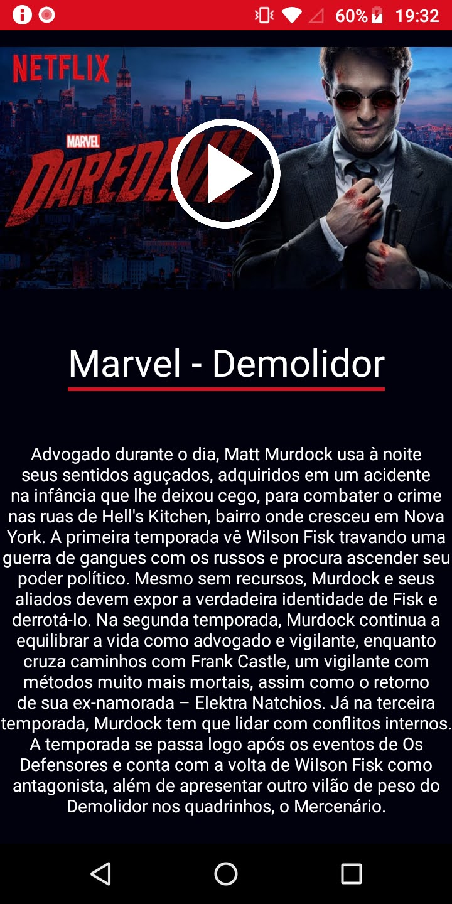
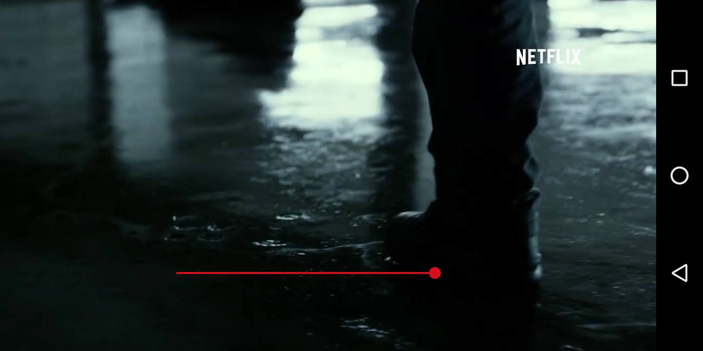
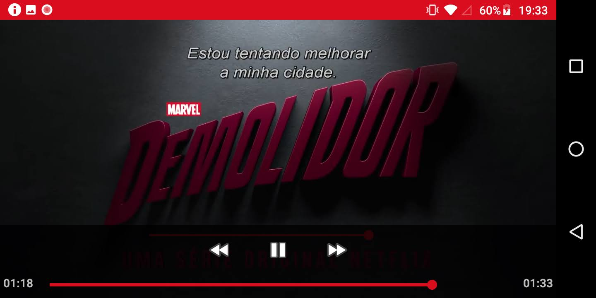

<h1>Sobre :</h1>
  <h3>Aplicativo simples com algumas funções sobre reprodução de video, o aplicativo possui uma tela com a sinopse da serie do demolidor e um pequeno trailer sobre o mesmo, o intuito desse aplicativo é conseguir fazer um reprodutor de midia
  (desenvolvido com base nas aulas)</h3>
 
<h1>Capturas de tela:<h1>
  
  
  
 

<h1>Como funciona :</h1>

<ul>
  <li> O aplicativo apresenta na primeira activity a sinopse da serie e uma miniatura do trailer sobre a serie, ao pressionar o botão de reproduzir , é aberto uma activity com o trailer</li>
  <li> O trailer está localizado no caminho VideoPlayer\app\src\main\res\raw </li>
  <li> A miniatura do trailer está localizada no caminho VideoPlayer\app\src\main\res\drawable </li>
  <li> O reprodutor possui 3 botões sendo eles :</li>
    <ol>botão de retroceder (volta 5 segundos do video)</ol>
    <ol>botão de continuar/parar</ol>
    <ol>botão de adiantar (adianta 15 segundos do video)</ol>
  <li>Possui uma seekBar que acompanha o proguesso da reprodução do video e é possivel controlar a reprodução do video com a mesma<l1>
  <li>Possui uma seekBar que controla o som de reprodução do dispositivo<l1>
</ul>
